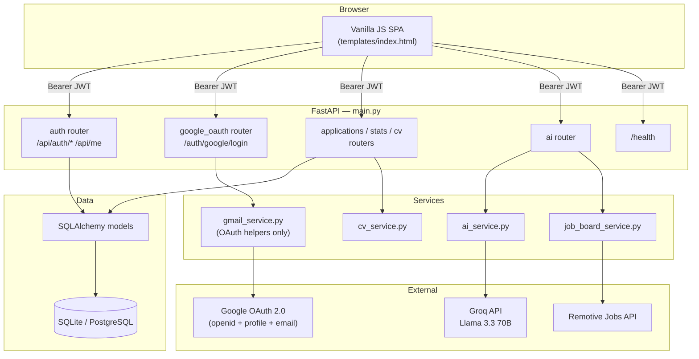

# Hired — AI Job Tracker

[](https://github.com/urwatulwusqa23/job-tracker/actions/workflows/ci.yml)


A self-hosted job application tracker with an AI copilot. Track every application you send, let AI analyse your CV against the roles you want, generate interview prep, and surface live job listings — all in one place.

**Live demo:** https://job-tracker-ai-fga4.onrender.com

---

## Features

- **Application tracking** — list view and Kanban board across Applied / Screening / Interview / Offer / Rejected / Withdrawn. Inline status dropdown so you never open a modal just to move a card.
- **AI import** — paste any recruitment email or job post and the AI extracts company, role, salary, location, and job URL automatically.
- **Interview prep** — generates technical and behavioural questions, salary negotiation advice, company research points, and personalised tips based on your CV and the job description.
- **Skills gap analysis** — compares your CV against every job you've applied for and returns ranked skill gaps, suggested courses, and project ideas.
- **Job recommendations** — fetches live remote listings from Remotive matched to keywords derived from your CV.
- **CV manager** — upload multiple PDF CVs, set one as active; all AI features use the active CV automatically.
- **Google sign-in** — one-click login via Google (email + profile only — no inbox access). Email/password login also supported.
- **Onboarding** — new accounts see a guided empty state with quick actions to add an application, import from email, or upload a CV.
- **Keyboard shortcut** — press `N` from anywhere to open the Add Application modal.
- **CSV export** — download all your applications as a spreadsheet in one click.
- **JWT auth** — bcrypt-hashed passwords, 30-minute access tokens, 30-day refresh tokens, single-tenant (registration closes after the first account).

---

## Tech stack

| Layer | Technology |
|---|---|
| Backend | FastAPI (Python 3.11) |
| ORM / migrations | SQLAlchemy 2.0 + Alembic |
| Auth | PyJWT access + refresh tokens, bcrypt |
| Validation | Pydantic v2 |
| AI | Groq API — Llama 3.3 70B (free tier, OpenAI-compatible endpoint) |
| Database | SQLite (dev / free-tier) or PostgreSQL (`DATABASE_URL` env var) |
| PDF parsing | pdfplumber |
| Server | Gunicorn + Uvicorn workers |
| Frontend | Vanilla JS + CSS (no build step, no dependencies) |
| Testing | pytest + pytest-cov (93%+ coverage, 120 tests) |
| CI | GitHub Actions (ruff lint → alembic check → pytest → Docker build) |
| Container | Docker / Docker Compose |

---

## Architecture



**Request flow:** SPA sends `Bearer <JWT>` → FastAPI's `get_current_user` dependency verifies the token and loads the user → the router delegates external work to a service → SQLAlchemy commits → the router maps DB column names to the JSON wire format the frontend expects (see `WIRE_TO_MODEL` in `app/routers/applications.py`).

---

## Project structure

```
job-tracker/
├── main.py                        # App assembly, middleware, /health
├── app/
│   ├── core/                      # Config (pydantic-settings), DB session, JWT/bcrypt, logging
│   ├── models/                    # SQLAlchemy models: User, Application, CV, InterviewPrep, ActivityLog
│   ├── schemas/                   # Pydantic request/response schemas
│   ├── routers/                   # Route handlers — one file per feature area
│   └── services/                  # External API clients: AI, CV parsing, job board, OAuth helpers
├── alembic/                       # Migration environment + versioned migrations
├── tests/                         # 120 pytest tests (mocks all external APIs, in-memory SQLite)
├── templates/                     # index.html + login.html — the full frontend
├── .github/workflows/ci.yml       # Lint → migrations check → test + coverage gate → Docker build
├── Dockerfile / docker-entrypoint.sh
├── docker-compose.yml
├── render.yaml                    # Render.com Blueprint
└── requirements.txt / requirements-dev.txt
```

---

## Quick start (local)

**Prerequisites:** Python 3.11+

```bash
git clone https://github.com/urwatulwusqa23/job-tracker.git
cd job-tracker

python -m venv .venv
source .venv/bin/activate        # Windows: .venv\Scripts\activate

pip install -r requirements.txt

cp .env.example .env
# Open .env and set at minimum:
#   XAI_API_KEY=gsk_...          (Groq key from console.groq.com)
#   AI_BASE_URL=https://api.groq.com/openai/v1
#   GROK_MODEL=llama-3.3-70b-versatile

alembic upgrade head             # creates the SQLite schema
python main.py                   # or: uvicorn main:app --reload
```

Open `http://localhost:8080`. The first account you create becomes the only account — registration closes automatically after that.

Swagger UI is available at `http://localhost:8080/docs`.

---

## Quick start (Docker)

```bash
cp .env.example .env             # add your Groq key (see above)
docker compose up -d
```

Open `http://localhost:8080`. The container runs `alembic upgrade head` automatically before serving traffic. Data persists in the `job_data` Docker volume.

---

## Running tests

```bash
pip install -r requirements-dev.txt
pytest              # full suite with coverage report (fails if coverage < 80%)
ruff check .        # lint
```

The suite mocks every external API (Groq, Google OAuth, Remotive) so it runs fully offline without any API keys. Each test gets an isolated in-memory SQLite database.

---

## Environment variables

| Variable | Default | Description |
|---|---|---|
| `SECRET_KEY` | *(auto-generated)* | Signs JWTs — set a fixed value in production |
| `DB_PATH` | `jobtracker.db` | SQLite file path; ignored when `DATABASE_URL` is set |
| `DATABASE_URL` | *(unset)* | PostgreSQL connection string — overrides `DB_PATH` |
| `FRONTEND_URL` | `http://localhost:8080` | Used to build OAuth redirect URLs |
| `ALLOWED_ORIGINS` | `*` | Comma-separated CORS origins |
| `ACCESS_TOKEN_EXPIRE_MINUTES` | `30` | JWT access token lifetime |
| `REFRESH_TOKEN_EXPIRE_DAYS` | `30` | JWT refresh token lifetime |
| `XAI_API_KEY` | *(required for AI)* | Groq API key — free at [console.groq.com](https://console.groq.com) |
| `AI_BASE_URL` | `https://api.x.ai/v1` | Set to `https://api.groq.com/openai/v1` for Groq |
| `GROK_MODEL` | `grok-3-mini` | Set to `llama-3.3-70b-versatile` for Groq |
| `GOOGLE_CLIENT_ID` | *(optional)* | Enables Google sign-in |
| `GOOGLE_CLIENT_SECRET` | *(optional)* | Enables Google sign-in |
| `REDIRECT_URI_LOGIN` | localhost default | Must match URI registered in Google Cloud Console |
| `SENTRY_DSN` | *(unset)* | Enables Sentry error tracking if set |
| `LOG_LEVEL` | `INFO` | Python logging level |

All AI features degrade gracefully when `XAI_API_KEY` is absent — you can still manually track applications with only `SECRET_KEY` set.

---

## Deploy to Render (free tier)

1. Push this repo to GitHub.
2. In the [Render dashboard](https://dashboard.render.com): **New → Blueprint**, connect your repo. Render reads `render.yaml`.
3. In the service's **Environment** tab, add these secrets:

   | Key | Value |
   |---|---|
   | `SECRET_KEY` | Any long random string |
   | `FRONTEND_URL` | `https://<your-app>.onrender.com` |
   | `XAI_API_KEY` | Groq key from [console.groq.com](https://console.groq.com) |
   | `AI_BASE_URL` | `https://api.groq.com/openai/v1` |
   | `GROK_MODEL` | `llama-3.3-70b-versatile` |
   | `GOOGLE_CLIENT_ID` | From Google Cloud Console *(optional)* |
   | `GOOGLE_CLIENT_SECRET` | From Google Cloud Console *(optional)* |
   | `REDIRECT_URI_LOGIN` | `https://<your-app>.onrender.com/auth/google/login/callback` *(optional)* |

4. If using Google sign-in, add `REDIRECT_URI_LOGIN` above to your OAuth client in [Google Cloud Console](https://console.cloud.google.com) → APIs & Services → Credentials → Authorised redirect URIs.
5. Redeploy.

**Free-tier caveats:**
- The service spins down after ~15 min of inactivity; the first request after that has a cold start of 30–60 s.
- No persistent disk on the free plan — the SQLite file resets on every deploy. For real persistence, point `DATABASE_URL` at a managed Postgres instance (no code changes needed; `psycopg2` is bundled).

### Other hosts (VPS / Railway / Fly.io)

```bash
docker compose up -d
```

Point a reverse proxy (nginx, Caddy) at port 8080. On Railway or Fly.io, connect the GitHub repo and set the same environment variables in the dashboard — both platforms detect the `Dockerfile` automatically.

---

## API reference

All routes except `/`, `/login`, `/register`, `/health`, and `/api/auth/*` + `/auth/google/*` require `Authorization: Bearer <access_token>`.

| Method | Path | Description |
|---|---|---|
| `POST` | `/api/auth/register` | Create the (single) account, returns JWT pair |
| `POST` | `/api/auth/login` | Email/password login, returns JWT pair |
| `POST` | `/api/auth/refresh` | Exchange refresh token for a new pair |
| `GET` / `PUT` | `/api/me` | Get / update profile |
| `PUT` | `/api/me/password` | Change password |
| `GET` | `/auth/google/login` | Start Google OAuth login |
| `GET` | `/api/stats` | Dashboard stats, follow-ups, recent activity |
| `GET` / `POST` | `/api/applications` | List / create applications |
| `PUT` / `DELETE` | `/api/applications/{id}` | Update / delete an application |
| `GET` / `POST` | `/api/cv` | List CVs / upload a PDF |
| `POST` | `/api/cv/{id}/activate` | Set a CV as active |
| `GET` | `/api/cv/{id}/download` | Download a CV |
| `GET` | `/api/cv/active_text` | Extracted text from the active CV |
| `POST` | `/api/extract_job` | AI-extract job details from pasted text or URL |
| `GET` / `POST` | `/api/interview_prep/{id}` | Get / generate interview prep for an application |
| `POST` | `/api/skills_gap` | Analyse CV against applied jobs |
| `POST` | `/api/job_recommendations` | Fetch live job listings matched to CV |
| `GET` | `/health` | Liveness + DB check |

Full interactive docs (request/response schemas, try-it-out) at `/docs` (Swagger UI) and `/redoc`.

---

## Design notes

- **Google OAuth scope** — login requests only `openid`, `email`, and `profile`. No inbox or Gmail access is requested at any point.
- **Stateless OAuth** — the OAuth `state` parameter is itself a short-lived signed JWT carrying the PKCE verifier, so the callback needs no server-side session to resume the flow.
- **Single-tenant by design** — built for one person to self-host. Registration is permanently disabled after the first account is created.
- **Wire format translation** — SQLAlchemy models use canonical column names (`company_name`, `date_applied`, `salary_expected`). The JSON API keeps shorter names (`company`, `applied_date`, `salary`) so the frontend never needed updating. Translation lives in `WIRE_TO_MODEL` in `app/routers/applications.py`.
- **XSS protection** — all user content in the frontend is rendered via a `h()` helper that sets `textContent` (DOM-safe) rather than injecting raw HTML strings.
