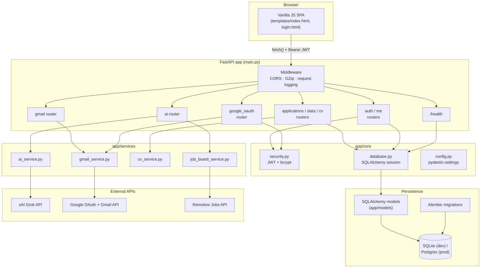

# Hired — AI Job Tracker

[](https://github.com/urwatulwusqa23/job-tracker/actions/workflows/ci.yml)


A self-hosted job application tracker with an AI copilot (xAI Grok), Gmail auto-import, and JWT auth — FastAPI + SQLAlchemy + Alembic backend, vanilla JS frontend, one Docker command to run.

## Features

- **Kanban board** — track applications across Applied / Screening / Interview / Offer / Rejected / Withdrawn
- **AI import** — paste any email or message and Grok extracts company, role, salary, location, and job URL automatically
- **Gmail integration** — sign in with Google (auto-connects Gmail), scan your inbox for job emails, or run a smart sync that auto-adds new applications and auto-marks rejections
- **Interview prep** — generates technical + behavioural questions, salary negotiation advice, company research points, and personalised tips, based on your CV and the job description
- **Skills gap analysis** — compares your CV against jobs you've applied for and returns skill gaps, ranked courses, projects to build, and market insights
- **Job recommendations** — pulls live remote listings from Remotive matched to keywords derived from your CV
- **CV manager** — upload multiple PDF CVs, set one as active; every AI feature uses the active CV automatically
- **JWT auth** — bcrypt-hashed passwords, short-lived access tokens + long-lived refresh tokens, single-tenant registration (locked after the first account)

## Architecture



**Request flow for a typical authenticated call:** the SPA sends a `Bearer` JWT → FastAPI's dependency injection resolves `get_current_user` (verifies the JWT, loads the `User` row) → the router calls a service function for any external API work (Grok, Gmail, Remotive) → SQLAlchemy commits the result → a translation layer in the router maps DB column names back to the wire JSON shape the frontend expects (see [Design notes](#design-notes)).

## Tech stack

| Layer | Technology |
|---|---|
| Backend framework | FastAPI (async-capable, OpenAPI docs at `/docs`) |
| ORM / migrations | SQLAlchemy 2.0 + Alembic |
| Auth | JWT (PyJWT) access + refresh tokens, bcrypt password hashing |
| Validation | Pydantic v2 schemas |
| AI | xAI Grok (OpenAI-compatible API) |
| Database | SQLite (dev/free-tier) or PostgreSQL (`DATABASE_URL` env var) |
| PDF parsing | pdfplumber |
| Server | Gunicorn + Uvicorn workers |
| Frontend | Vanilla JS + CSS (no build step) |
| Testing | pytest + pytest-cov (93%+ coverage) |
| CI | GitHub Actions (lint, test, Docker build) |
| Monitoring | JSON structured logs, `/health` endpoint, optional Sentry |
| Container | Docker / Docker Compose |

## Project structure

```
job-tracker/
├── main.py                  # FastAPI app assembly, middleware, /health
├── app/
│   ├── core/                # config (pydantic-settings), database session, JWT/bcrypt security, logging
│   ├── models/               # SQLAlchemy models (User, Application, CV, InterviewPrep, OAuthToken, ActivityLog)
│   ├── schemas/              # Pydantic request/response schemas
│   ├── routers/               # FastAPI route handlers (one file per feature area)
│   └── services/              # Business logic / external API clients (AI, Gmail, CV parsing, job board)
├── alembic/                  # Migration environment + versioned migrations
├── tests/                    # pytest suite (unit + integration, mocks all external APIs)
├── templates/                # index.html / login.html — the vanilla JS frontend
├── .github/workflows/ci.yml  # Lint + test + coverage gate + Docker build
├── Dockerfile / docker-entrypoint.sh   # Runs Alembic migrations, then Gunicorn+Uvicorn
├── docker-compose.yml
├── render.yaml                # Render.com Blueprint (free tier)
└── requirements.txt / requirements-dev.txt
```

## Quick start (local)

**Prerequisites:** Python 3.11+, pip

```bash
git clone https://github.com/urwatulwusqa23/job-tracker.git
cd job-tracker

python -m venv .venv
source .venv/bin/activate        # Windows: .venv\Scripts\activate

pip install -r requirements.txt

cp .env.example .env
# Edit .env — add your XAI_API_KEY at minimum

alembic upgrade head              # creates the SQLite schema
python main.py                    # or: uvicorn main:app --reload
```

Open `http://localhost:8080`. The first account you register becomes the only account (single-tenant) — registration closes automatically after that.

Interactive API docs (Swagger UI) are available at `http://localhost:8080/docs` in any environment.

## Quick start (Docker)

```bash
cp .env.example .env
# Edit .env and add your XAI_API_KEY

docker compose up -d
```

Open `http://localhost:8080`. The container runs `alembic upgrade head` automatically on startup before serving traffic (see `docker-entrypoint.sh`). Data persists in the `job_data` Docker volume.

## Running tests

```bash
pip install -r requirements-dev.txt
pytest                    # runs the full suite with coverage, fails if coverage < 80%
ruff check .              # lint
```

The test suite mocks every external API (Grok, Google OAuth, Gmail, Remotive) so it runs offline and deterministically — no real API keys or network access needed. It uses an isolated in-memory SQLite database per test, so it never touches your local `jobtracker.db`.

## Environment variables

| Variable | Default | Description |
|---|---|---|
| `SECRET_KEY` | *(auto-generated if unset)* | Signs JWTs — set a real value in production |
| `DB_PATH` | `jobtracker.db` | SQLite file path (ignored if `DATABASE_URL` is set) |
| `DATABASE_URL` | *(unset)* | Overrides `DB_PATH` — set this to use PostgreSQL instead of SQLite |
| `FRONTEND_URL` | `http://localhost:8080` | Used to build OAuth-login redirect URLs |
| `ALLOWED_ORIGINS` | `*` | Comma-separated CORS origins |
| `ACCESS_TOKEN_EXPIRE_MINUTES` | `30` | JWT access token lifetime |
| `REFRESH_TOKEN_EXPIRE_DAYS` | `30` | JWT refresh token lifetime |
| `XAI_API_KEY` | *(required for AI features)* | xAI/Groq API key |
| `GROK_MODEL` | `grok-3-mini` | Model name |
| `AI_BASE_URL` | `https://api.x.ai/v1` | OpenAI-compatible base URL (swap for Groq, etc.) |
| `GOOGLE_CLIENT_ID` / `GOOGLE_CLIENT_SECRET` | *(optional)* | Enables Google sign-in + Gmail scan/sync |
| `REDIRECT_URI` / `REDIRECT_URI_LOGIN` | localhost defaults | Must match the URIs registered in Google Cloud Console |
| `SENTRY_DSN` | *(unset)* | Enables error tracking if set — no-op otherwise |
| `LOG_LEVEL` | `INFO` | Python logging level |

All AI and Gmail features degrade gracefully without their keys configured — you can still manually track applications with just `SECRET_KEY`.

## Deployment (Render, free tier)

1. Push this repo to GitHub.
2. In the [Render dashboard](https://dashboard.render.com): **New → Blueprint**, connect this repo. Render reads `render.yaml` and provisions the service.
3. In the service's **Environment** tab, fill in the secrets marked `sync: false` in `render.yaml`: at minimum `XAI_API_KEY`. Google OAuth vars are optional.
4. After the first deploy, Render assigns you a URL like `https://job-tracker-ai.onrender.com`. Set `FRONTEND_URL` to that value (with `https://`), and if using Google OAuth, update `REDIRECT_URI` / `REDIRECT_URI_LOGIN` to match and add them as authorized redirect URIs in Google Cloud Console.
5. Redeploy. Your live URL is the one from step 4.

**Free-tier caveats** (call these out to yourself before relying on this for real data):
- The free web service spins down after ~15 min of inactivity; the next request has a cold start of 30–60s.
- The free plan has no persistent disk, so the SQLite file resets on every deploy/restart. For real persistence, either upgrade to a paid disk or point `DATABASE_URL` at a managed Postgres instance — `psycopg2` is already bundled, so no code changes are needed.

### Any other Docker host / VPS / Railway

```bash
docker compose up -d
```

Point a reverse proxy (nginx, Caddy) at port 8080, or on Railway: **New Project → Deploy from GitHub repo**, Railway detects the `Dockerfile` automatically — set the same environment variables as above in its dashboard.

## Monitoring

- `GET /health` — checks the app is up and the database is reachable (used by Render's health check and any uptime monitor).
- Structured JSON logs to stdout for every request (method, path, status, duration, request ID) and full tracebacks on unhandled exceptions — pipe these into your platform's log viewer (Render/Railway both capture stdout automatically) or a log aggregator.
- Set `SENTRY_DSN` to get exception tracking and basic performance traces in [Sentry](https://sentry.io) — omit it and Sentry is never initialized.

## Design notes

- **Full feature parity with the original Flask app** was a deliberate choice during the FastAPI migration, including Google OAuth sign-in and persistent Gmail sync, at the cost of a larger surface area than a minimal rewrite would have.
- **DB columns vs. JSON wire format**: SQLAlchemy models use the field names from the target schema (`company_name`, `date_applied`, `salary_expected`), but the JSON API keeps the original wire names (`company`, `applied_date`, `salary`) so the existing frontend JS needed zero changes to its data model. The translation happens in the router layer (see `WIRE_TO_MODEL` in `app/routers/applications.py`).
- **Stateless Google OAuth**: since JWT auth has no server-side session, the OAuth `state` parameter is itself a short-lived signed JWT carrying the PKCE verifier (and, for the Gmail-connect flow, the user ID) — the callback needs no server-side session to resume the flow.
- **Single-tenant by design**: this mirrors the original app's registration model — it's built for one person to self-host, not as a multi-tenant SaaS.

## API endpoints

All endpoints except `/`, `/login`, `/register`, `/health`, and the `/api/auth/*` + `/auth/google/*` OAuth routes require an `Authorization: Bearer <access_token>` header.

| Method | Path | Description |
|---|---|---|
| `POST` | `/api/auth/register` | Create the (single) account, returns JWT pair |
| `POST` | `/api/auth/login` | Log in, returns JWT pair |
| `POST` | `/api/auth/refresh` | Exchange a refresh token for a new pair |
| `GET`/`PUT` | `/api/me` | Get/update profile |
| `PUT` | `/api/me/password` | Change password |
| `GET` | `/auth/google/login` | Start Google sign-in |
| `GET` | `/auth/google` | Connect a Gmail account for scanning |
| `GET` | `/api/gmail/status` | Which Gmail accounts are connected |
| `POST` | `/api/gmail/disconnect` | Disconnect a connected Gmail account |
| `GET` | `/api/stats` | Dashboard stats, follow-ups, recent activity |
| `GET`/`POST` | `/api/applications` | List / create applications |
| `PUT`/`DELETE` | `/api/applications/{id}` | Update / delete an application |
| `GET`/`POST` | `/api/cv` | List CVs / upload a CV (PDF) |
| `POST` | `/api/cv/{id}/activate` | Set a CV as active |
| `GET` | `/api/cv/{id}/download` | Download a CV |
| `GET` | `/api/cv/active_text` | Extracted text from the active CV |
| `POST` | `/api/extract_job` | AI-extract job details from pasted text |
| `POST` | `/api/gmail_scan` | One-off scan of Gmail inbox for job emails |
| `POST` | `/api/gmail/sync` | Auto-add new applications / auto-mark rejections from Gmail |
| `GET`/`POST` | `/api/interview_prep/{id}` | Get / generate interview prep for an application |
| `POST` | `/api/skills_gap` | Analyse CV against applied jobs |
| `POST` | `/api/job_recommendations` | Fetch live job listings matched to CV |
| `GET` | `/health` | Liveness + DB connectivity check |

Full interactive documentation (request/response schemas) is auto-generated at `/docs` (Swagger UI) and `/redoc`.
